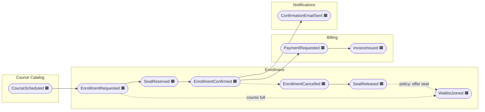
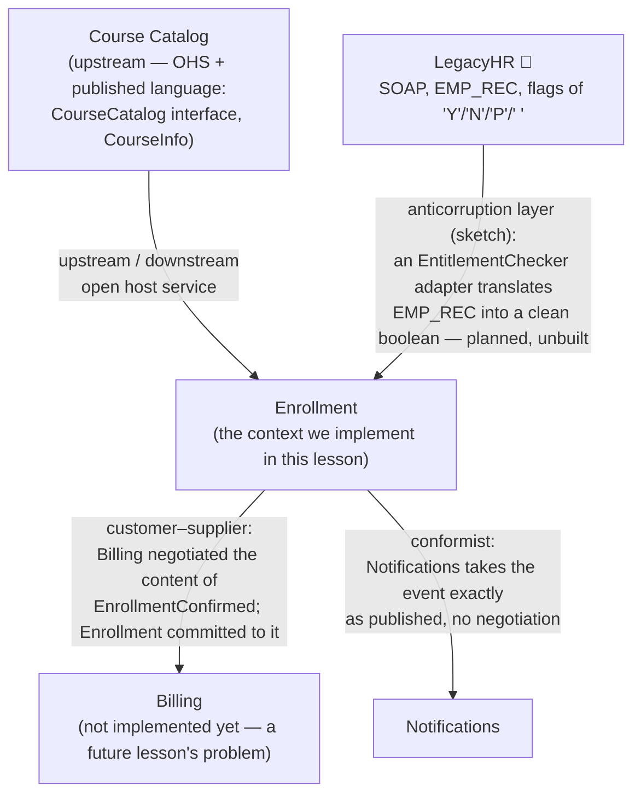

# Event storming handout — training-course registration

Output of a big-picture EventStorming session (Brandolini-style) for the platform you are
using right now: a system where people find training courses, enroll, get invoiced, and get
notified. Three hours, one long paper roll, the whole "team" in the room. This document is
the photo of the wall, transcribed.

**Sticky-note legend** (Brandolini's colors):

| Color | Meaning |
|---|---|
| 🟧 orange | **Domain event** — something that happened, past tense |
| 🟦 blue | **Command** — someone's intent to make it happen |
| 🟨 yellow | **Aggregate** — the thing that decides whether it happens |
| 🟪 lilac | **Policy** — "whenever X happens, do Y" |
| 🟥 red | **Hotspot** — disagreement, confusion, or a question nobody could answer |
| 🩷 pink | **External system** — something we don't control |

## The timeline

Left to right, as it ended up after the third re-shuffle:

The same timeline as a flat list, with the commands (🟦) and aggregates (🟨) that produce
each event:

| Command 🟦 | Actor | Aggregate 🟨 | Event 🟧 |
|---|---|---|---|
| ScheduleCourse | Training coordinator | Course | CourseScheduled |
| RequestEnrollment | Attendee | Enrollment | EnrollmentRequested |
| ReserveSeat | System (policy) | Enrollment | SeatReserved |
| ConfirmEnrollment | Attendee | Enrollment | EnrollmentConfirmed |
| CancelEnrollment | Attendee | Enrollment | EnrollmentCancelled, SeatReleased |
| JoinWaitlist | Attendee | Waitlist | WaitlistJoined |
| RequestPayment | Policy: on EnrollmentConfirmed | Invoice | PaymentRequested |
| IssueInvoice | Billing clerk / policy | Invoice | InvoiceIssued |
| SendConfirmationEmail | Policy: on EnrollmentConfirmed | — (stateless) | ConfirmationEmailSent |

**Policies 🟪 spotted:** *whenever* EnrollmentConfirmed → request payment; *whenever*
EnrollmentConfirmed → send confirmation email; *whenever* SeatReleased → offer the seat to
the first waitlist entry.

## Pivotal events

The group marked three events as **pivotal** — the points where the language in the room
audibly changed and different people started talking:

1. **CourseScheduled** — before it, everything is the coordinator's world (curriculum,
   trainers, rooms). After it, a course is just *a thing with a code and a capacity* that
   people enroll into. Boundary: **catalog | enrollment**.
2. **EnrollmentConfirmed** — before it, the conversation is seats, waitlists, deadlines.
   After it, it is money and messages. Nobody downstream cares *how* confirmation happened.
   Boundary: **enrollment | billing, notifications**.
3. **InvoiceIssued** — after this the finance people stopped listening entirely
   ("that's bookkeeping now"). Boundary: **billing | the accounting system we don't own**.

Pivotal events are where bounded contexts usually want to be cut — the vocabulary shift IS
the boundary (this is the heuristic from Khononov's *Learning DDD*, ch. 1–3, and Brandolini's
"the language changes when you cross a boundary").

## Hotspots 🟥 (left unresolved on purpose — some feed the lesson exercises)

- **Who owns seat availability?** Capacity is a catalog fact, but reservations live in
  enrollment. Decision so far: catalog publishes capacity; enrollment owns the count of
  reserved seats. Nobody is fully happy.
- **Is a confirmed enrollment valid before payment?** Sales says yes (invoice later),
  finance says no. Decision: confirmation and payment are separate facts in separate
  contexts — which is exactly why `EnrollmentConfirmed` is pivotal.
- **The LegacyHR flag.** Corporate attendees are only entitled to employer-paid training if
  LegacyHR's SOAP endpoint returns `EMP_REC.TRAINING_ENTITLEMENT_FLAG = 'Y'`. That flag —
  with its `'Y'/'N'/'P'/space` values — must never leak into our model.

## Subdomain classification

The group's classification, with reasoning left as a lesson exercise (step 1 in the README —
try it yourself before opening the answer there):

| Subdomain | Type (fill in: core / supporting / generic) | Your reasoning |
|---|---|---|
| Enrollment (seats, waitlists, confirmation rules) | ? | ? |
| Course Catalog | ? | ? |
| Billing | ? | ? |
| Notifications | ? | ? |

## Context map

Relationship notes from the wall:

- **Catalog → Enrollment**: catalog is upstream and serves many consumers, so it exposes an
  **open host service** with a **published language** (`CourseCatalog`, `CourseInfo`).
  Enrollment references courses **by identifier** (`CourseId`) — never by holding the
  catalog's entities.
- **Enrollment → Billing**: **customer–supplier**. Billing (downstream customer) needs the
  attendee, the course, and the seat count in the confirmation fact; Enrollment (upstream
  supplier) agreed to carry them in `EnrollmentConfirmed` and to treat that event as a
  contract. Billing is not implemented in this codebase yet — the event is the interface it
  will consume.
- **Enrollment → Notifications**: **conformist**. Notifications is a generic subdomain;
  investing in negotiation or translation there would be effort spent where we least
  differentiate. It consumes the published event as-is.
- **LegacyHR → Enrollment**: **anticorruption layer**, sketched only. Whatever adapter we
  build will expose something like `boolean employerPaysFor(Email attendee)` to the
  enrollment context and keep `TRAINING_ENTITLEMENT_FLAG` quarantined inside the adapter.
  (Stretch goal in the README.)
